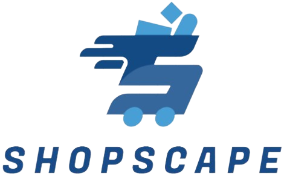

<!DOCTYPE html>
<html lang="en">
<head>
    <meta charset="UTF-8">
    <meta name="viewport" content="width=device-width, initial-scale=1.0">
</head>
<body>

<h1>ShopScape - ReactJS Project</h1>

<h2>Overview</h2>

This is an online shop project developed using ReactJS. It allows users to browse through various product categories, add items to their cart, and make purchases.

<h2>Instructions</h2>

<h3>Initial Setup</h3>
<ol>
    <li><strong>Clone Repository:</strong> Clone this repository to your local machine using the following command:
        <pre><code>git clone https://github.com/PeriAmiga/ShopScape.git</code></pre></li>
    <li><strong>Install Dependencies:</strong> Navigate to the project directory and install the necessary dependencies:
        <pre><code>cd your-repository
npm install</code></pre></li>
</ol>

<h3>Running the Application</h3>
<ol>
    <li><strong>Start Development Server:</strong> Run the following command to start the development server:
        <pre><code>npm start</code></pre></li>
    <li><strong>Open in Browser:</strong> Open your web browser and navigate to <code>http://localhost:3000</code> to view the application.</li>
</ol>

<h2>Features</h2>
<ul>
    <li>Browse and search products by category.</li>
    <li>Add items to the cart and manage cart contents.</li>
    <li>View product details and images.</li>
    <li>Checkout and place orders.</li>
</ul>

<h2>Technologies Used</h2>
<ul>
    <li><strong>ReactJS:</strong> Used as the primary frontend library for building the user interface.</li>
    <li><strong>React Router:</strong> Used for managing routing within the application.</li>
    <li><strong>Bootstrap:</strong> Used for styling and layout.</li>
</ul>

<h2>Dependencies</h2>
<ul>
    <li>React Router</li>
    <li>Bootstrap</li>
</ul>

</body>
</html>